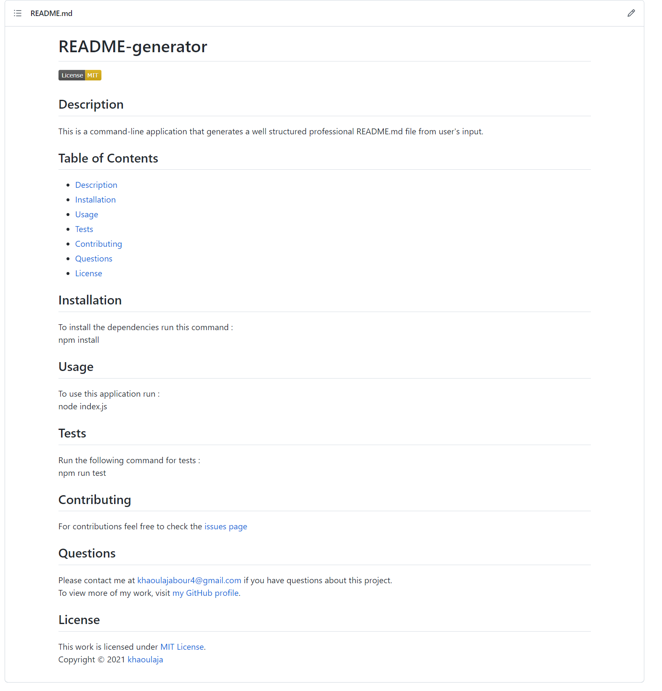

# README-generator

  

  ## Description 

  This is a command-line application that generates a well structured professional README.md file from user's input.  
  The following is a sample of a generated README file.   
  

  ## Table of Contents

  * [Description](#description)
  * [Installation](#installation)
  * [Usage](#usage)
  * [Questions](#questions)
  * [License](#license)
  
  
  ## Installation
  
  To install the dependencies run this command :   npm install
  
  ## Usage 

   To use this application run :   node index.js

  ## Questions
  
  Please contact me at [khaoulajabour4@gmail.com](mailto:khaoulajabour4@gmail.com) if you have questions about this application.  
  To view more of my work, visit [my GitHub profile](https://github.com/khaoulaja).

  ## License

  This work is licensed under [MIT License](https://opensource.org/licenses/MIT). 
  Made with ❤ by Khaoula Jabour  
  &copy; 2021 README-generator

